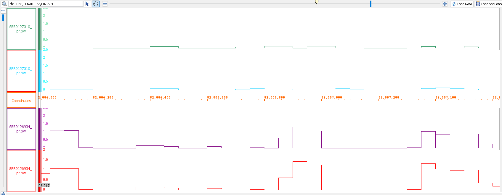

\newpage
```{python, set_up}
# | echo: false
# | eval: true

# chargue the libraries
import pandas as pd
import subprocess as sp
from jupyter_core.migrate import regex
import os
import seaborn as sns
import matplotlib.pyplot as plt


# first we load the metadata specific of our samples
metadata_df = pd.read_csv("data/Meatadata_male_bone_1_24M.tsv", sep="\t")
SRR_ids = list(metadata_df["srr_id"])
``` 

# Pre-proccesing previous alignments
Once we have donde the aligments we can made the filtering of those with [samtools](https://www.htslib.org/doc/samtools.html) especially with the `samtools view` command, this command allows us to filter the alignments based on different criteria like the mapping quality, the flag of the alignment, etc. 

```{python filter_alignments}
# | eval: false

# iterate over all th e SRR ids to run de corresponding alingments
for srr in SRR_ids:
    sp.run(
        ["qsub", "src/jdl/clean_alignments.jdl", "-s", srr, "-p", "results/alignments"]
    )
``` 

```{python verify_clean}
#| echo: false
#| eval: true


def count_files(pattern):
    cmd = f"ls {pattern} 2>/dev/null | wc -l"
    result = sp.run(cmd, shell=True, capture_output=True, text=True)
    return result.stdout.strip()


print(
    f"There are {count_files('results/alignments/clean/*HIun_clean.bam')} hisat clean unpaired alignments "
    f"{count_files('results/alignments/clean/*HIpr_clean.bam')} hisat clean paired alignments"
)

print(
    f"There are {count_files('results/alignments/clean/*SRun_clean.bam')} star clean unpaired alignments "
    f"{count_files('results/alignments/clean/*SRpr_clean.bam')} star clean paired alignments"
)

print(
    f"There are {count_files('results/alignments/clean/*HIun*.bai')} hisat clean unpaired indexed alignments "
    f"{count_files('results/alignments/clean/*HIpr*.bai')} hisat clean paired indexed alignments"
)

print(
    f"There are {count_files('results/alignments/clean/*SRun*.bai')} star clean unpaired indexed alignments "
    f"{count_files('results/alignments/clean/*SRpr*.bai')} star clean paired indexed alignments"
)
```

# PseudoAligners 
Once the alignment the next step is the quantification of the reads this can be assed by tools like `featureCounts` from [Subread](https://subread.sourceforge.net/SubreadUsersGuide.pdf) this generates a table file with the counts for each gene in function of a reference genome annotation (GFF or GTF file) and the `bam` files generated for a common aligner, this generates a table of counts that is the milestone for the diferential expression analysis, but there is another approach in where the bam files are not generated and even the alignment euristic does not is follow in a traditional way. 

In the **pseudoAligmnets** the alogorithms, on big terms, use a de brujin graph to represent the reference genome as transcripts and the reads try to follow the paths on the possible transcripts based in a probability model, in wich the transcipt with the best probability is the one that is selected for the quantification of the reads, this has a upgrade in the time and resources used for the quantification and also reported a correlation near to 1 with the aligment approach, also it does not has to procces the bam files for quntification using `featureCounts` or similar tools, so it is a more direct approach for the quantification of the reads, they use tools like [tximport](https://bioconductor.org/packages/release/bioc/vignettes/tximport/inst/doc/tximport.html) for merging all the counts made by tools like [kallisto](https://kallisto.readthedocs.io/en/latest/) or [salmon](https://salmon.readthedocs.io/en/latest/salmon.html) in a single table for the following analysis. 


## Salmon 
Salmon is a pseudoaligner that could make both a `mapping-based` quantification and a `aligment-based` quantification, in this analysis we are going to use the `mapping-based` approach that is the one that use the **quasi-mapping** algorithm and is diferent to the traditional time consuming aligment approach.

>This indexes were provided so the salmon index procedure were not neccesary


## Kallisto 
In the case of Kallisto pseudo aligner we have to generate an index because it have not been provided by the class so we have to generate it using a multifasta file with al the transcriptome of the genome version we are working with, in this case the m36 version of the mouse genome, we can obtain this multifasta file from genecode and then generate the index with the `kallisto index` command.

\newpage

```{bash kallisto_index}
# | eval: false 

#first we obtain the multifasta file with the transcriptome of the m36 version of the mouse genome
wget https://ftp.ebi.ac.uk/pub/databases/\
gencode/Gencode_mouse/release_M36/gencode.vM36.transcripts.fa.gz \
-O data/indexes/mouse_m36_transcriptome.fa.gz
#now we can download the gtf file with the annotation
wget https://ftp.ebi.ac.uk/pub/databases/\
gencode/Gencode_mouse/release_M36/gencode.vM36.chr_patch_hapl_scaff.annotation.gtf.gz \ 
-O data/indexes/mouse_m36_annotation.gtf.gz 
#finally the comopresive genome fasta file 
wget https://ftp.ebi.ac.uk/pub/databases/\
gencode/Gencode_mouse/release_M36/GRCm39.genome.fa.gz \
-O data/indexes/mouse_m36_genome.fa.gz
#generate the directory for kallisto indexes
mkdir -p data/indexes/kallisto/
#generate the directory for kb indexes 
mkdir -p data/indexes/kb/

#now we generate the index with the kallisto index command 
conda run -n kallisto kallisto index \
-i data/indexes/kallisto/mouse_m36_transcriptome.idx data/indexes/mouse_m36_transcriptome.fa.gz \
-t 4 

#now we generate the index with the kallisto index command 
conda run -n bio_informatics kb ref -i data/indexes/kb/mouse_m36_transcriptome.idx \
-g data/indexes/kb/mouse_m36_t2g.txt -t 8 \
-f1 data/indexes/mouse_m36_transcriptome.fa.gz \
data/indexes/mouse_m36_genome.fa.gz data/indexes/mouse_m36_annotation.gtf.gz
```

The next step is to build the sample table for the kallisto quantification, this is a table with the sample names and the paths to the fastq files for each sample, this is necessary for the `kallisto quant` command that is the one that make the quantification of the reads, then we can run the `kallisto quant` program for all the samples. 

```{python build_sample_table}
# | echo: false
# | eval: true

# data frames for the sample table
paired_kallisto_df = pd.DataFrame.from_dict(
    {
        "sample": metadata_df["name"].str.split("_").str[0]
        + "_"
        + metadata_df["months"].astype(str),
        "fastq_1": "data/"
        + metadata_df["srr_id"]
        + "/"
        + metadata_df["srr_id"]
        + "_1_clean.fastq",
        "fastq_2": "data/"
        + metadata_df["srr_id"]
        + "/"
        + metadata_df["srr_id"]
        + "_2_clean.fastq",
    }
)
unpaired_kallisto_df = pd.DataFrame.from_dict(
    {
        "sample": metadata_df["name"].str.split("_").str[0]
        + "_"
        + metadata_df["months"].astype(str),
        "fastq_1": "data/"
        + metadata_df["srr_id"]
        + "/"
        + metadata_df["srr_id"]
        + "_1_clean.fastq",
    }
)
unpaired_kallisto_df.sort_values("sample", inplace=True)
paired_kallisto_df.sort_values("sample", inplace=True)

# save the tables with the information for the kallisto quantification
paired_kallisto_df.to_csv(
    "data/indexes/kallisto/paired_kallisto_samples.csv",
    index=False,
    header=False,
    sep="\t",
)
unpaired_kallisto_df.to_csv(
    "data/indexes/kallisto/unpaired_kallisto_samples.csv",
    index=False,
    header=False,
    sep="\t",
)

display(paired_kallisto_df)
display(unpaired_kallisto_df)
``` 

\newpage

For using the tables with the metadata we ares using the kb prgrams from the suite kallisto-bustools, this suite have a program called `kb ref` that allows us to generate the index for the quantification and also the table with the annotation of the genes for the following analysis, this is something that we have to do before running the quantification with kallisto.


```{bash}
#| eval: false

#output directory for the kb indexes
output_dir="results/pseudo_alignments/kb/paired"
mkdir -p $output_dir

#run kallisto for paired data 
echo "conda run -n bio_informatics kb count \
-i data/indexes/kb/mouse_m36_transcriptome.idx \
-g data/indexes/kb/mouse_m36_t2g.txt \
-x BULK --parity paired -o $output_dir --bootstraps 100 \
--tmp kb_paired -t 8 -m 12G \
data/indexes/kallisto/paired_kallisto_samples.csv"|\
qsub \
-N "kb_PR" \
-cwd \
-o "${output_dir}_kbPR.out" \
-e "${output_dir}_kbPR.err" \
-q default \
-pe smp 8 \
-l h_rt=04:00:00 \
-l h_vmem=16G 

#=====================================================================
#unpaired
#=====================================================================

output_dir="results/pseudo_alignments/kb/unpaired"
mkdir -p $output_dir

#run kallisto for unpaired data
echo "conda run -n bio_informatics kb count \
-i data/indexes/kb/mouse_m36_transcriptome.idx \
-g data/indexes/kb/mouse_m36_t2g.txt \
-x BULK --parity single -o $output_dir --bootstraps 100 --tmp kb_unpaired \
-t 8 -m 12G \
data/indexes/kallisto/unpaired_kallisto_samples.csv"|\
qsub \
-N "kb_UN" \
-cwd \
-o "${output_dir}_kbUN.out" \
-e "${output_dir}_kbUN.err" \
-q default \
-pe smp 8 \
-l h_rt=04:00:00 \
-l h_vmem=16G 
```

>The kb pipeline is better for single cell data so for comparison we are using the results from the old kallisto program

\newpage

## Run

With the sample tables made for the kallisto quantification we can run the `kallisto quant` and `salmon quant` for all the samples, this will generate a table with the counts for each gene in function of the reference genome annotation and the bam files generated for a common aligner, this generates a table of counts that is the milestone for the diferential expression analysis. 

```{python salmon}
# | eval: false

# first we generate the temporary scripts for the salmon quantification
sp.run(["bash", "src/Generate_tempsPseudo.sh"])

# now we can make the aligment for each sample
for srr in SRR_ids:
    sp.run(["qsub", "src/jdl/pseudo_align.jdl", "-S", srr])
```

>Note here both pseudo aligners were run with 4 threads and 12 gigabytes of memory, also because both pseudo-aligners support boopstrapping for abundance estimation the number of boostrappings were set in 100, it is also important to note that in salmon the options --gcBias, --seqBias, --posBias, --validateMappings, --rangeFactorizationBins(in 4), were set.  

### Parse results 
With all the pseudo aligments made now we can asses the clean a parsed of both results and log files, this, essentially, is for deleting all the intermate bootstrapping files that kallist make and for parsing the stadistics from the pseudoaligment, those like oveall alignment, time and what pseudo-aligner done it. 
```{bash parse_pseudo}
#| eval: false

#Run the script for pasing the results
bash src/parsed_pseudo.sh -p results/pseudo_alignments
```


```{python read_tables}
# | echo: false
# | eval: true
# | df-print: default

# fist we read the tables
res_df = pd.read_csv("results/pseudo_alignments/pseudo_align_stats.tsv", sep="\t")

display(
    res_df.style.format({"%_aligned": "{:.3f}", "Time(min)": "{:.3f}"}).hide(
        axis="index"
    )
)
```

## Analysis 
With the results that we have parsed we can make comparisons between both aligners and their times of run.

```{python plots}
# | echo: false
# | eval: true

# ========================================================================
# Total aligned vs time
# ========================================================================

# add label to text in the dataframe
res_df["text_id"] = [id[len(id)-3::] for id in list(res_df["SRR_id"])]

label_colors = {"sal": "#161fcfff", "kal": "#d11313ff"}

fig_scater, ax = plt.subplots(figsize=(10, 6))
fig_scater.set_facecolor("#d7ecfff1")
sns.scatterplot(
    data=res_df,
    x="%_aligned",
    y="Time(min)",
    hue="Aligner",
    palette=label_colors,
    style="Type",
    ax=ax,
)
for _, row in res_df.iterrows():
    ax.annotate(
        row["text_id"],
        (row["%_aligned"], row["Time(min)"]),
        textcoords="offset points",
        xytext=(5, 5),
        fontsize=8,
    )

ax.set_title("Total aligned vs time")
ax.legend(loc="upper left", bbox_to_anchor=(1.02, 1))
ax.grid(True, linestyle="--", alpha=0.5)
ax.set_facecolor("#7a6ab949")

plt.tight_layout()
plt.show()
```

We can see in this plot that the general tendency of the results is that, as with the traditional aligners, the time used to align, or in this case "pseudo-align", paired data is greater than that used for single-end data. This difference is larger for `salmon`.

Another tendency shared with traditional aligners is that the alignment rate is higher in the single-end data.

It is important to note that `salmon` has a more time-consuming performance. This is due to the time required for correcting biases (`--gcBias`, `--seqBias`, `--posBias`) and for improving abundance estimates (`--validateMappings`, `--rangeFactorizationBins`). We can see that this is worthwhile for improving the alignment rate in the case of the options that correct biases in the reads (further analysis would be needed to evaluate the impact of the abundance estimation options).

\newpage

# Big-wig files 

Another feature than can be analiced by the results of the aligments are the bigwig files, these can be generated by the `bamCoverage` program from the [deeptools](https://deeptools.readthedocs.io/en/develop/content/tools/bamCoverage.html) suite, this program allows us to generate bigwig files from the bam files generated by the aligners, this bigwig files can be visualized in genome browsers like [IGV](https://software.broadinstitute.org/software/igv/), [UCSC Genome Browser](https://genome.ucsc.edu/) or [IGB](https://www.bioviz.org) and can give us a visual representation of the coverage of the reads in the genome, this can be useful for seeing the quality of the alignment and also for seeing if there are any regions of the genome that are not being covered by the reads. 

This can be useful for seeing the overall diference between samples and between the coditions that we are trying to elucidate the expression diferences for that we are going to use only the paired end data that we have generated for both traditional aligners (`star` and `hisat`) this because are those that generate bam files. 

```{python bigwig}
#| eval: False

# run the bigwig processing for every SRR id
for srr in SRR_ids:
    sp.run(["qsub", "src/jdl/run_bamCov.jdl", "-p", "results/alignments/clean/", "-s", srr])
```

## Results 

For this brief analysis with the `IGB` genome browser, we have arbitrarily selected two samples from both conditions tested in our tissue (1 and 24 months). These are `SRR9126934` for 24 months and `SRR9127010` for 1 month. With these samples, we searched in the genome browser for the positions related to the gene **Ccl8**, referring to the cytokine that is associated with inflammation, which the authors in the original paper relate to the progression of life.
```{python positions}
#| echo: false
#| eval: true

t2g_df = pd.read_csv("data/indexes/kb/mouse_m36_t2g.txt", sep="\t", header=None)
t2g_df.columns = [
    "gene_id",
    "trans_id",
    "gene_name",
    "isoform",
    "chromosome",
    "start",
    "end",
    "strand",
]
# clean the ids
t2g_df["gene_id"] = t2g_df["gene_id"].str.replace(r"\..*", "", regex=True)
t2g_df["trans_id"] = t2g_df["trans_id"].str.replace(r"\..*", "", regex=True)
# find the one related with B2m
display(t2g_df[t2g_df["gene_name"] == "Ccl8"])
``` 



We can see that the expression of the gene Ccl8 is consistent with the data reported by the authors, it is important to note that thi is not a concluding result because here we are only viewing that the normalization a semi-quantification that bamCovarage do capture the difference acrros this 2 samples, and that diference is consitent in the data proccesed with `hisat2` and `star`, so this is a good insight for the next steps. 

\newpage

# Quantification 
Once we have all the aligments and pseudoaligments done we can start assesing to construct the famous **count matrix** in wich the rows are the genes reported in our reference genome annotation (normally a `GTF` file) and the columns are the samples that we have in our experiment, this count matrix is totally made by `kb` (kallisto-bustools), for salmon is partially made because it uses uniques fastq files (paired or unpaired) but because it *maps* the reads to the transcriptome, those genes are already quantified so we only have to merge the tables generated for each sample in a single table with all the samples, this is something that is done by the `tximport` package in R. 

But for the case of the traditional aligners we have to use the `featureCounts` program from the [Subread](https://subread.sourceforge.net/SubreadUsersGuide.pdf) suite, this program allows us to generate a count matrix from the bam files generated by the aligners and the reference genome annotation (GTF file) and the bam files generated by the alignment of each sample to the reference genome, in the case of our analysis we have made 2 diferent aligments types (**paired** and **unpaired**) for each aligner (`hisat2` and `star`) having 4 diferent count matrixes to generate with featureCounts, this plus the ones that were made by by pseudoaligners. 

| Aligner | type | number_samples | results_path |
|:-----:|:-----:|:-----:|:-----:|
| hisat | paired | 8 | results/alignments/clean/*HIpr_clean.bam | 
| hisat | unpaired | 8 | results/alignments/clean/*HIun_clean.bam |
| star | paired | 8 | results/alignments/clean/*SRpr_clean.bam |
| star | unpaired | 8 | results/alignments/clean/*SRun_clean.bam |
| salmon | paired | 8 | results/pseudo_alignments/salmon/*salPR |
| salmon | unpaired | 8 | results/pseudo_alignments/salmon/*salUN |
| kallisto | paired | 8 | results/pseudo_alignments/kb/paired |
| kallisto | unpaired | 8 | results/pseudo_alignments/kb/unpaired | 


#### FeatureCounts 

```{bash featureCounts}
#| eval: false

# Run the feature counts for hisat2 and star for paired and unpaired data
bash src/run_featureC.sh -p results/alignments/clean/ -g data/indexes/mouse_m36_annotation.gtf.gz
```

\newpage

#### Tximport 
```{r tximport}
# | eval: false

#import the libraries
library(tximport)
library(readr)

#load the required tables for the tximport
t2g_df <- read.table("data/indexes/kb/mouse_m36_t2g.txt", sep = "\t")
#keep only the columns t2g that matters for tximport (transcript id and gene id)
trans_2_gen_tx <- t2g_df[1:2]
#clean those columns
trans_2_gen_tx$V1 <- gsub("\\..*", "", trans_2_gen_tx$V1)
trans_2_gen_tx$V2 <- gsub("\\..*", "", trans_2_gen_tx$V2)

metadata_df <- read.table(
  "data/Meatadata_male_bone_1_24M.tsv",
  header = TRUE,
  sep = "\t"
)


for (aligner in c("salmon", "kallisto")) {
  #asign the file with the counts for each aligner
  if (aligner == "salmon") {
    count_file <- "quant.sf"
  } else {
    count_file <- "bs_abundance_99_clean.tsv"
  }
  #extract aligner abreviation
  align_sub <- substr(aligner, 1, 3)
  #create the vector with the paths for the results
  paired_files <- file.path(
    "results/pseudo_alignments",
    aligner,
    paste0(metadata_df$srr_id, paste0("_", align_sub, "PR")),
    count_file
  )
  single_files <- file.path(
    "results/pseudo_alignments",
    aligner,
    paste0(metadata_df$srr_id, paste0("_", align_sub, "UN")),
    count_file
  )
  #out the respectuve names to the vector
  sample_names <- paste0(metadata_df$name, "_", metadata_df$months)
  names(paired_files) <- sample_names
  names(single_files) <- sample_names
  #merge the salmon quantification results
  txi_paired <- tximport(paired_files, type = aligner, tx2gene = trans_2_gen_tx)
  txi_unpaired <- tximport(
    single_files,
    type = aligner,
    tx2gene = trans_2_gen_tx
  )
  #save the counts matrix
  write.csv(
    txi_paired,
    file.path(
      "results/count_mtr",
      paste0(align_sub, "_", "pr", "countMtr.txt")
    ),
    sep = "\t"
  )
  write.csv(
    txi_unpaired,
    file.path(
      "results/count_mtr",
      paste0(align_sub, "_", "un", "countMtr.txt")
    ),
    sep = "\t"
  )
}
```


### Count Matrices

With all the previous steps, we generated the count matrices. These are 8 in total, 2 for each aligner or pseudo-aligner (`hisat2`, `star`, `salmon`, `kallisto`), which are visualized below:

### Cleaning the featureCounts Matrices

The tables generated with `featureCounts` have a comment line, and the columns that contain the counts are labeled with the file path they come from. Therefore, we are going to clean them.

```{bash}
#| eval: false

#clean for every SR or HI mtrx
for mtrx in results/count_mtr/[SRHI]*_*countMtr.txt; do
    #make the output name 
    out_file=${mtrx/.*/"_clean.txt"}
    #clean the matrix
    awk 'BEGIN{FS=OFS="\t"};
        NR == 1{next} 
        NR==2 {printf "%s%s", $1,"\t";
            for(i=7;i<=14;i++){
                sub(/.*\//, "", $i)
                sub(/_.*/,"",$i)
                printf "%s%s", $i,(i<14 ? "\t" : "\n")
            }
        } NR != 2 {print($1,$7,$8,$9,$10,$11,$12,$13,$14)}' "$mtrx" > $out_file
done
```

\newpage

### Hisat
```{python hisatPR}
#| echo: false
#| eval: true
#| tbl-cap: "Count matrix generated by hisat2 with paired-end data"

count_mtrx = pd.read_csv("results/count_mtr/HI_pr_countMtr_clean.txt", sep="\t")

display(count_mtrx.set_index("Geneid").rename_axis(None).head())
``` 


```{python hisatPR}
#| echo: false
#| eval: true
#| tbl-cap: "Count matrix generated by hisat2 with single-end data"

count_mtrx = pd.read_csv("results/count_mtr/HI_un_countMtr_clean.txt", sep="\t")

display(count_mtrx.set_index("Geneid").rename_axis(None).head())

``` 

### star 
```{python hisatPR}
#| echo: false
#| eval: true
#| tbl-cap: "Count matrix generated by star with paired-end data"

count_mtrx = pd.read_csv("results/count_mtr/HI_pr_countMtr_clean.txt", sep="\t")

display(count_mtrx.set_index("Geneid").rename_axis(None).head())

``` 


```{python hisatPR}
#| echo: false
#| eval: true
#| tbl-cap: "Count matrix generated by star with single-end data"

count_mtrx = pd.read_csv("results/count_mtr/HI_un_countMtr_clean.txt", sep="\t")

display(count_mtrx.set_index("Geneid").rename_axis(None).head())
``` 

### salmon
```{python hisatPR}
#| echo: false
#| eval: true
#| tbl-cap: "Count matrix generated by salmon with paired-end data"

count_mtrx = pd.read_csv("results/count_mtr/sal_prcountMtr.txt")
counts_columns = [
    column
    for column in list(count_mtrx.columns)
    if "counts." in column or column == "Unnamed: 0"
]
mtrx_clean = count_mtrx[counts_columns].set_index("Unnamed: 0").rename_axis(None)
mtrx_clean.columns = [col.split(".")[1] for col in list(mtrx_clean.columns)]

display(mtrx_clean.head().style.format("{:.1f}"))
``` 


```{python hisatPR}
#| echo: false
#| eval: true
#| tbl-cap: "Count matrix generated by salmon with single-end data"

count_mtrx = pd.read_csv("results/count_mtr/sal_uncountMtr.txt")
counts_columns = [
    column
    for column in list(count_mtrx.columns)
    if "counts." in column or column == "Unnamed: 0"
]
mtrx_clean = count_mtrx[counts_columns].set_index("Unnamed: 0").rename_axis(None)
mtrx_clean.columns = [col.split(".")[1] for col in list(mtrx_clean.columns)]

display(mtrx_clean.head().style.format("{:.1f}"))

``` 

### kallisto
```{python hisatPR}
#| echo: false
#| eval: true
#| tbl-cap: "Count matrix generated by kallisto with paired-end data"

count_mtrx = pd.read_csv("results/count_mtr/kal_prcountMtr.txt")
counts_columns = [
    column
    for column in list(count_mtrx.columns)
    if "counts." in column or column == "Unnamed: 0"
]
mtrx_clean = count_mtrx[counts_columns].set_index("Unnamed: 0").rename_axis(None)
mtrx_clean.columns = [col.split(".")[1] for col in list(mtrx_clean.columns)]

display(mtrx_clean.head().style.format("{:.1f}"))
``` 


```{python hisatPR}
#| echo: false
#| eval: true
#| tbl-cap: "Count matrix generated by kallisto with single-end data"

count_mtrx = pd.read_csv("results/count_mtr/kal_uncountMtr.txt")
counts_columns = [
    column
    for column in list(count_mtrx.columns)
    if "counts." in column or column == "Unnamed: 0"
]
mtrx_clean = count_mtrx[counts_columns].set_index("Unnamed: 0").rename_axis(None)
mtrx_clean.columns = [col.split(".")[1] for col in list(mtrx_clean.columns)]

display(mtrx_clean.head().style.format("{:.1f}"))
``` 

\newpage
# Discussion 

Here we made the next step of the RNA-seq data processing. The quantification step uses the results from the previous alignments in order to obtain the expression levels that are relative to each sample. This is crucial because in this step we do not only have to condensate all the information stored in the BAM files, we also have to make sure that all that information is concordant with the genome we have indexed and also with its annotation. Here, the genomic positions that were the result of the alignments start to make sense in that they now have a gene or transcript name as a product of the combination of three essential information sources: the **BAM** files, the **FASTA** with the transcriptome, and the **GTF** file with the annotation of all those transcripts reported in the genome. With the tool `featureCounts` from the `Subread` package, we can combine these to generate the count matrices with the traditional alignment procedure.

Another approximation that we explore in this report is the **pseudo-alignment** approach, in which we use two alignment tools, `salmon` and `kallisto`. These have different optimization procedures but are based on the same de Bruijn graph approximation, in which the search space is reduced dramatically by searching only in the transcriptome. One of the advantages of this procedure is that it does not generate a **BAM** file; instead, because their indexes already contain the annotation, they generate an analogous sample-specific count matrix that can be merged with all the other samples' count matrices using tools like `tximport`. One disadvantage of this approach is that it does not have the possibility to uncover expression of transcripts that are not reported in the reference data. This is supposed to be balanced by the fact that this approach tends to be faster, something that we do not observe in the time consumption of both algorithms. It is important to note that this may be due to the use of bootstrapping and `salmon`-specific options that maximize not only resource consumption but also time, resulting in similar scales compared with the traditional aligners. Additionally, we can note that the alignment rate is lower than that obtained with `hisat2` and `STAR` (traditional aligners), likely due to the reduced search space.

Finally, it is interesting to observe, in a preliminary way, the differences between samples and between experimental conditions using a **genome browser**, obtained from processing the **BAM** files together with the annotation files. This is a good approximation to generate hypotheses about possible real differences between conditions, but it is not, in any way, conclusive evidence of biological differences between them. More sophisticated statistical modeling is needed to assess this, which will be addressed in further differential expression analysis.


# Code  
All the code and extended results are disponible in [Tabula_Muris_Transcriptomic_analysis](https://github.com/MaxHuesca/Tabula_Muris_Trasncriptomics_analysis/tree/main) git hub repository