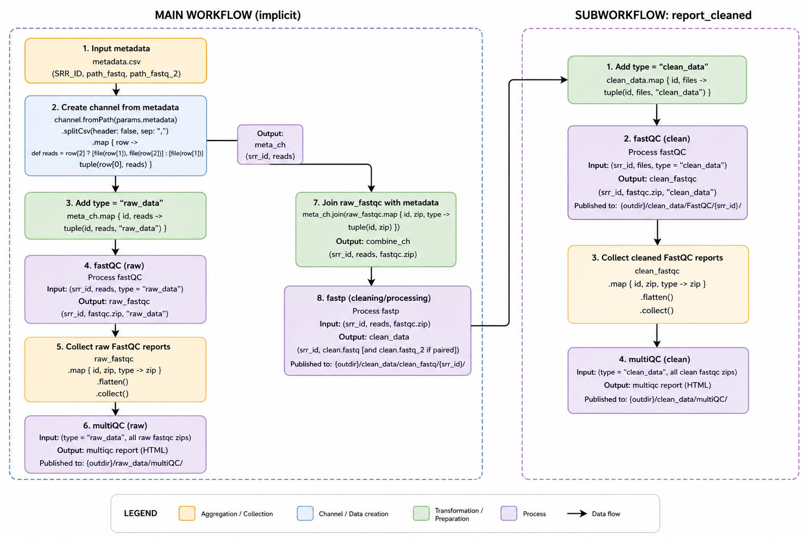
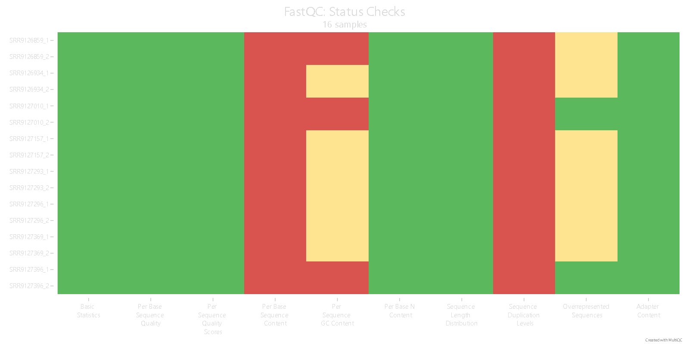
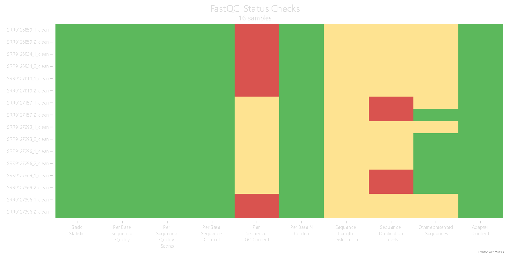

---
title: "Report 3 Cleaning using a nextflow pipeline"
author: "Ismael Maximiliano De Los Santos Huesca"
date: today

format:
  pdf:
    include-before-body: portada.tex
    documentclass: article
    geometry: margin=2cm
    fontsize: 10pt
    number-sections: true
    fig-cap-location: bottom
    df-print: kable
    toc: true
    toc-title: "Table of Contents"

execute:
  warning: false
  message: false
  echo: true
  eval: false
  freeze: auto

project:
  type: default
  execute-dir: project

code-block-font-size: \footnotesize

jupyter: bio_informatics

header-includes:
  - \usepackage{graphicx}
  - \usepackage{amsmath}
  - \usepackage{booktabs}
  - \usepackage{float}
  - \usepackage{caption}
  - \captionsetup{font=small}
--- 
\newpage

```{python, set_up}
#| echo: false

import pandas as pd 
import subprocess as subP 
import os 
``` 

# Clean pipeline 
Additionally, we developed a **Nextflow** pipeline in order to make this preprocessing by the automation of the FastQC reports and also the fastp cleaning. This is made by extracting the features that the FastQC output has in the following way: 

For each category:
- Basic Statistics
- Per base sequence quality
- Per sequence quality scores
- Per base sequence content
- Per sequence GC content
- Per base N content
- Sequence Length Distribution
- Sequence Duplication Levels
- Overrepresented sequences
- Adapter Content 

While searching for `FAIL` in each category in order to assign the following fastp flags: 

|QC feature|fastp flag |
|:-------------------------:|:---------------------:|
|Per base sequence content|--trim_front|
|Sequence Duplication Levels|--dedup|
|Overrepresented sequences|--overrepresentation_analysis| 

For that parsing, we are using the following basic bash script (awk as the main language).

```{bash}
#| eval: false 
#review the Per base sequence content field 
base_cont=$(grep "Per base sequence content" <(echo -e $sum) | cut -f1 | grep "FAIL" | uniq)
if [[ $base_cont=="FAIL" ]]; then 
    base_cont="--trim_front1 ${trim_fron}"
else 
    base_cont=""
fi 

#review the Sequence Duplication Levels 
dup_lev=$(grep "Sequence Duplication Levels" <(echo -e $sum) | cut -f1 | grep "FAIL" | uniq )
if [[ $dup_lev=="FAIL" ]]; then 
    dup_lev="--dedup"
else
    dup_lev=""
fi 

#review the over represetation sequences
over=$(grep "Sequence Duplication Levels" <(echo -e $sum) | cut -f1 | grep "FAIL" | uniq)
if [[ $over=="FAIL" ]]; then 
    over="--overrepresentation_analysis"
else
    over=""
fi 
``` 

This code generates the QC-dependent arguments that we use to clean the fastq files and make sure it works with both paired and unpaired data. 
> It can be reviewed in more detail in the `src/run_fastp.sh` script 

\newpage

## Input

For usage, we have to provide a table without a header but with the SRR ID column and the paths for fastq data, so we are using the metadata table to construct it in a: 
`<srr_id>|<path1>|[path2]` 
format that we generate:


```{python}
meta_clean = pd.read_csv("data/metadata_clean.csv", sep="\t")
# build the data frame
meta_cleaning = pd.DataFrame(meta_clean["srr_id"])
meta_cleaning["path_1"] = (
    "data/" + meta_cleaning["srr_id"] + "/" + meta_cleaning["srr_id"] + "_1.fastq"
)
meta_cleaning["path_2"] = (
    "data/" + meta_cleaning["srr_id"] + "/" + meta_cleaning["srr_id"] + "_2.fastq"
)
# save it as a csv
meta_cleaning.to_csv("data/metadata_cleanNF.csv", header=False, index=False)
display(meta_cleaning)
``` 

## `.config` file
With the data made now, we can run the Nextflow pipeline and also use a `.config` file for running the pipeline using the Sun Grid Engine queue system. This is useful to provide the arguments of our pipeline: 
- threads: argument to control how many CPUs are used for each step 
- outdir: the path where the output file will be stored 
- metadata: the path to the input CSV table 
- conda_env: general Conda environment to run the principal programs
- fastp_env: the Conda environment where `fastp` is stored 
- trimF: the number of bases to trim from the front when it is required 

```{bash}
#| eval: false 

/*
This profile is made to run the the preprocesing pipeline in a cluster related to the profile in this script
or in local if the local profile is selected 
*/ 
params {
    //main options
    threads = 8
    outdir = "results/nf/clean_data"
    metadata = "data/metadata_cleanNF.csv"
    conda_env= "/export/space3/users/ismadlsh/conda/bio_informatics" 
    fastp_env= "fastp"
    //fastp
    trimF=15
} 
profiles {
    //configure 2 profiles 

    //local running 
    local {
        process{
            executor = 'local'
            cpus = 8
            memory = '16 GB'
        }
    }
    //One for sungride engine
    sge{
        //general configuration for all process
        process{
            executor = "sge"
            penv ="smp"
            cpus = 8
            memory = '10 GB'
            clusterOptions = "-q default -cwd -l h_rt=05:00:00"
        }
    }
}
``` 

## Run and process
Run it using `nextflow` and the profile `sge`
```{bash}
#| eval: false
nextflow run src/clean_data.nf -c src/clean_data.config -profile sge

``` 

The pipeline has the following processes that are controlled by 2 workflows:  

### Workflows 
To control the execution of all the processes in the pipeline, we have two workflows: the implicit main workflow and the `report_cleaned` workflow in order to clean the data, as well as make the **QC** reports from both: 

```{groovy}
//for making the reports of the cleaning step
workflow report_cleaned {

    take:
        cleaned_fastqs

    main:
        clean_fastqc = fastQC(cleaned_fastqs).fastq_out

        clean_fastqc
            .map { _id, zip_pths -> zip_pths }
            .flatten()
            .collect()
            .set { all_fastqc_clean }

        multiQC( all_fastqc_clean.map{ tuple("clean_data", it) } )
}

//main implicit workflow
workflow {
    //check if the user is providing paired data or not 
    meta_ch = channel.fromPath(params.metadata)
        .splitCsv(header: false, sep: ",")
        .map {row ->
            def reads = row.size() > 2 && row[2] ? 
            [ file(row[1]), file(row[2]) ] :
            [ file(row[1]) ]
            tuple(row[0], reads)
        }

    //QC proccess
    raw_fastqc=fastQC(meta_ch.map{ _id, _paths -> tuple (_id , _paths, "raw_data")}).fastq_out 
    //merge the with the data paths 
    combine_ch=meta_ch.join(raw_fastqc)

    //clean the data 
    clean_data=fastp(combine_ch).fastq_clean
    //now we can make the fastqc reports of the clean data 
    report_cleaned(clean_data.map{ _id, _paths -> tuple (_id , _paths, "clean_data")})

    //condensate all the fastqc 
    raw_fastqc
        .map { _id, zip_pths -> zip_pths}
        .flatten()
        .collect()
        .set { all_fastqc_raw } 
    
    //now multiqc the reports 
    multiQC( all_fastqc_raw.map{ tuple("raw_data", it) } )
} 
``` 

So in this workflow, first we read the table in order to obtain the paths of the data and the SRR ID, even if they are paired or unpaired ones. With this first **channel** created, we can move the info beyond the processes: 

### FastQC
This process gets a tuple that, based on the workflow, comes from a channel. This tuple has not only the parsed data from the table, but also the tag if it is the cleaned data or the raw one, this to control the output directories where the data is going to be saved. This data goes out from the table containing the SRR ID as well as the generated FastQC reports, only the zip ones, that contain all the information that we would require in the next steps.

```{groovy}
process fastQC {
    //name of the nextflow job 
    tag "${srr_id}_QCreps_${type}"
    //save options 
    publishDir "${params.outdir}/${type}/FastQC/${srr_id}", mode: 'copy'

    input:
        tuple val(srr_id), path(srr_files),val(type)
    output: 
        tuple val(srr_id), path("*_fastqc.zip"), emit: fastq_out
    script:
    """
    fastqc -t ${params.threads} ${srr_files.join(' ')}
    """
}

``` 

### fastp 
The next process, naturally, is to clean the data. This is done by the `fastp` process, which takes as input another **tuple** with the SRR ID and the `.zip` results from the `FastQC` process in the way that we presented above. In addition, the `fastq` paths that we parsed in order to have the files for the cleaning process:

```{groovy}

process fastp {
    //name of the nextflow job 
    tag "${srr_id}_fastp"
    //save options 
    publishDir "${params.outdir}/clean_data/clean_fastq/${srr_id}", mode: 'copy'

    input:
        tuple val(srr_id), path(srr_files), path(fastqc_res)
    output: 
        tuple val(srr_id), path("*_clean.fastq"), emit: fastq_clean
    script:
    """ 
    #make this for every zip file 
    bash ${projectDir}/run_fastp.sh ${params.trimF} ${params.fastp_env} ${fastqc_res.join(' ')}
    

    """
} 
``` 

### MultiQC 
Finally, the pipeline condenses all the QC reports in a MultiQC step at the end of each **quality control** step with all the `.zip` files generated, and for saving the information, also the tag if it is `clean_data` or `raw_data`:

```{groovy}
process multiQC{
    //name of the nextflow job 
    tag "multiQC_${type}"
    //save options 
    publishDir "${params.outdir}/${type}/multiQC/", mode: 'copy'

    input:
        tuple val(type), path(fastqc_reps)
    output: 
        path("*.html"), emit: multiqc_res
    script: 
    """
    multiqc ${fastqc_reps.join(' ')}
    """
}
```

### Overview



\newpage

## Results 

This generate the following structure:
```{bash}
#| eval: false

results/nf_cleaning
├── clean_data
│   ├── clean_fastq
│   │   ├── SRR9126859
│   │   │   ├── SRR9126859_1_clean.fastq
│   │   │   └── SRR9126859_2_clean.fastq
│   │   ├── SRR9126934
│   │   │   ├── SRR9126934_1_clean.fastq
│   │   │   └── SRR9126934_2_clean.fastq
│   │   ├── SRR9127010
│   │   │   ├── SRR9127010_1_clean.fastq
│   │   │   └── SRR9127010_2_clean.fastq
│   │   ├── SRR9127157
│   │   │   ├── SRR9127157_1_clean.fastq
│   │   │   └── SRR9127157_2_clean.fastq
│   │   ├── SRR9127293
│   │   │   ├── SRR9127293_1_clean.fastq
│   │   │   └── SRR9127293_2_clean.fastq
│   │   ├── SRR9127296
│   │   │   ├── SRR9127296_1_clean.fastq
│   │   │   └── SRR9127296_2_clean.fastq
│   │   ├── SRR9127369
│   │   │   ├── SRR9127369_1_clean.fastq
│   │   │   └── SRR9127369_2_clean.fastq
│   │   └── SRR9127396
│   │       ├── SRR9127396_1_clean.fastq
│   │       └── SRR9127396_2_clean.fastq
│   ├── FastQC
│   │   ├── SRR9126859
│   │   │   ├── SRR9126859_1_clean_fastqc.zip
│   │   │   └── SRR9126859_2_clean_fastqc.zip
│   │   ├── SRR9126934
│   │   │   ├── SRR9126934_1_clean_fastqc.zip
│   │   │   └── SRR9126934_2_clean_fastqc.zip
│   │   ├── SRR9127010
│   │   │   ├── SRR9127010_1_clean_fastqc.zip
│   │   │   └── SRR9127010_2_clean_fastqc.zip
│   │   ├── SRR9127157
│   │   │   ├── SRR9127157_1_clean_fastqc.zip
│   │   │   └── SRR9127157_2_clean_fastqc.zip
│   │   ├── SRR9127293
│   │   │   ├── SRR9127293_1_clean_fastqc.zip
│   │   │   └── SRR9127293_2_clean_fastqc.zip
│   │   ├── SRR9127296
│   │   │   ├── SRR9127296_1_clean_fastqc.zip
│   │   │   └── SRR9127296_2_clean_fastqc.zip
│   │   ├── SRR9127369
│   │   │   ├── SRR9127369_1_clean_fastqc.zip
│   │   │   └── SRR9127369_2_clean_fastqc.zip
│   │   └── SRR9127396
│   │       ├── SRR9127396_1_clean_fastqc.zip
│   │       └── SRR9127396_2_clean_fastqc.zip
│   └── multiQC
│       └── multiqc_report.html
└── raw_data
    ├── FastQC
    │   ├── SRR9126859
    │   │   ├── SRR9126859_1_fastqc.zip
    │   │   └── SRR9126859_2_fastqc.zip
    │   ├── SRR9126934
    │   │   ├── SRR9126934_1_fastqc.zip
    │   │   └── SRR9126934_2_fastqc.zip
    │   ├── SRR9127010
    │   │   ├── SRR9127010_1_fastqc.zip
    │   │   └── SRR9127010_2_fastqc.zip
    │   ├── SRR9127157
    │   │   ├── SRR9127157_1_fastqc.zip
    │   │   └── SRR9127157_2_fastqc.zip
    │   ├── SRR9127293
    │   │   ├── SRR9127293_1_fastqc.zip
    │   │   └── SRR9127293_2_fastqc.zip
    │   ├── SRR9127296
    │   │   ├── SRR9127296_1_fastqc.zip
    │   │   └── SRR9127296_2_fastqc.zip
    │   ├── SRR9127369
    │   │   ├── SRR9127369_1_fastqc.zip
    │   │   └── SRR9127369_2_fastqc.zip
    │   └── SRR9127396
    │       ├── SRR9127396_1_fastqc.zip
    │       └── SRR9127396_2_fastqc.zip
    └── multiQC
        └── multiqc_report.html

``` 

\newpage

## Analysis 
So now we are able to compare both the MultiQC with the raw data and the MultiQC generated with the pipeline that uses an automatic fastq cleaning process: 

### Raw data 
 

We can see that the general problems of the data are: 

- Per base sequence content: this is due to the noise that is intrinsic to the first bases that are present in the sequences, representing a clear bias 
- Per sequence GC content: This field is also a problem because it could be an insight into contamination due to the inconsistencies in the GC content 
- Sequence Duplication Levels: This is also one of the problems that are more commonly present in fastq data; this should be because of the ribosomal RNA
- Overrepresented sequences: the sequences that are overrepresented are related to the duplication levels due to ribosomal RNA 

So the pertinent fastp flags were used in order to clean and account for some of those problems. 

\newpage

### Original preprocessing 

We can see that as we did not use an analysis of every FastQC report in the previous step in a semi-autonomous way, the corrections related to the previous problems are not contundent or even there are no changes. 

### Clean data 
 
When we performed the cleaning in order with the `FAIL` features present in the `zip` files from the **FastQC** reports, we can see that some problems like the **duplication levels** or the **base sequence content** are fixed or partially fixed. However, this could be a little problem in the **FastQC** as we are cleaning those reads that have low consistency at the beginning of the reads. This is why now not all the libraries have the same length distribution. 

Finally, some problems such as the GC bias are not corrected here but should be in next steps using options from other tools like `salmon`.

\newpage

## Conclusion 
While parsing and processing a significant number of samples or libraries from sequencing experiments, it is important to not do them one by one, as the computational tools and frameworks allow parallelization and **sequentialization** of the processes. This is particularly the basis of pipelines and workflow managers like Nextflow. 
Nextflow is a very useful tool as we can combine dynamic results using **channels**, multiprocessing with their **functions** and **processes**, all controlled by one or more **workflows**. This is particularly useful when extracting statistics from one step in order to be used for cleaning (as is the example of this made pipeline). This combination of the own directories that Nextflow uses and manages in the `work` directory makes it easier to manage the relative and absolute routes in the input step, as Nextflow uses symbolic links to manage all the external files and the output files, in order to not only save the results in a specific path but also to select what outputs of the process we are saving.

## Code  
All the code and extended results are disponible in [Tabula_Muris_Transcriptomic_analysis](https://github.com/MaxHuesca/Tabula_Muris_Trasncriptomics_analysis/tree/main) git hub repository