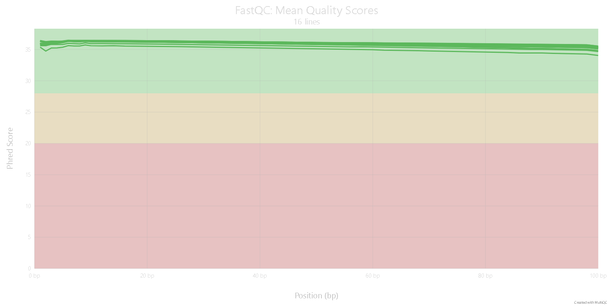
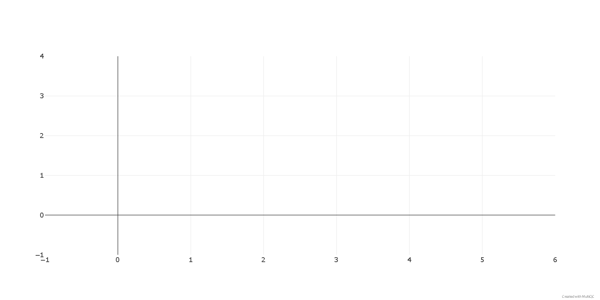
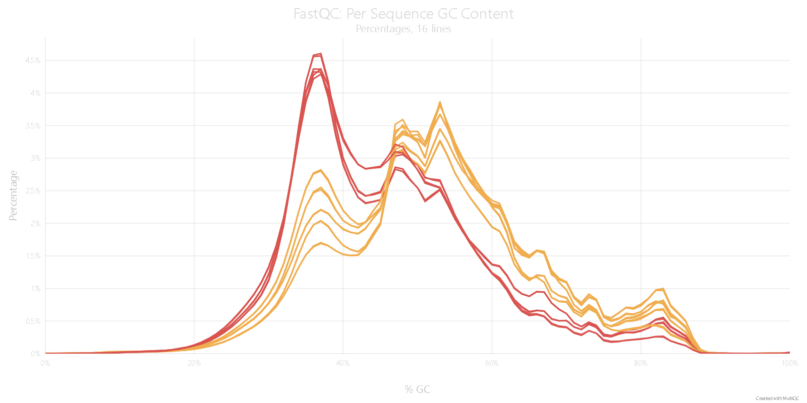
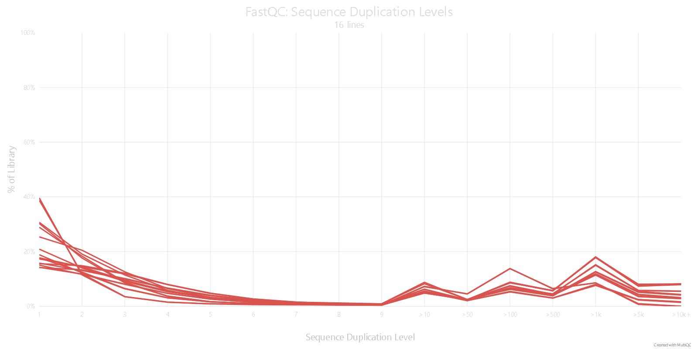
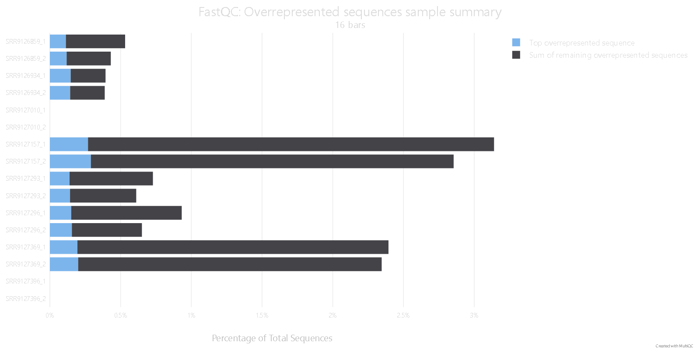
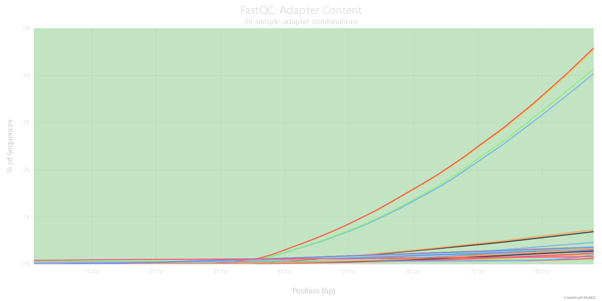
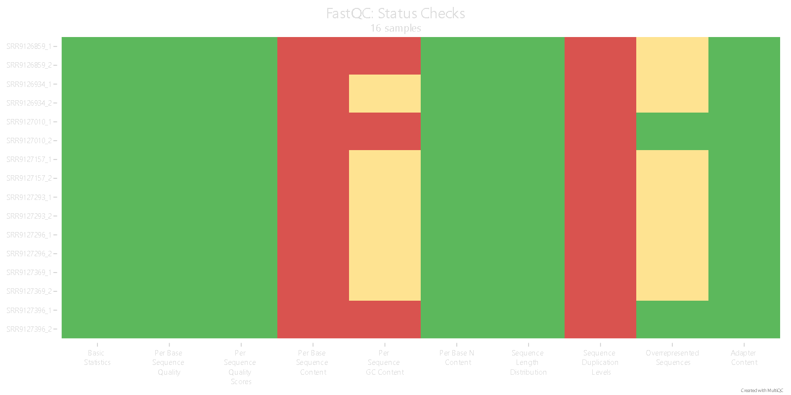

This script is used to download and preprocess the raw sequencing data from the RNA-seq experiments of the [Ageing hallmarks exhibit organ-specific temporal signatures](https://www.nature.com/articles/s41586-020-2499-y). Here, we focus on the male samples, particularly on the bone tissue at 1 and 24 age stages:

```{python, set_up}
#| echo: false

import pandas as pd 
import subprocess as subP 
import os 
``` 

### Download data 
To access the data download, we use the program `fasterq-dump`. This is already installed in the Chaac server, so we can use subprocess from Python in order to make the download. To do so, we need the metadata for the experiment; this is stored in the GEO accession number [GSE132040](https://www.ncbi.nlm.nih.gov/geo/query/acc.cgi?acc=GSE132040).

```{bash, obtain_metadata}
#| eval: false

#Download the metadata table
wget https://ftp.ncbi.nlm.nih.gov/geo/series/GSE132nnn/GSE132040/suppl/ \
GSE132040%5FMACA%5FBulk%5Fmetadata.csv.gz -O data/Tabula_Muris_GSE_metadata.csv.gz 

gunzip data/Tabula_Muris_GSE_metadata.csv.gz
``` 

```{python, filter_meta}
# | results: asis
# | echo: false

# first we have to obtain the srr ids wityh the metada
metadata_GSE = pd.read_csv("data/Tabula_Muris_GSE_metadata.csv")

print("The columns present in the metadata are:\n")
for col in metadata_GSE.columns:
    print(f"- {col}")

# we have to focus in the 'characteristics: age' , 'characteristics: sex' and 'source name'
metadata_bone_GSE = metadata_GSE[
    (metadata_GSE["characteristics: age"].isin(["1", "24"]))
    & (metadata_GSE["characteristics: sex"] == "m")
    & (metadata_GSE["source name"].str.contains("bone", case=False))
]
print(
    f"The organims from who the samples come form is {list(metadata_bone_GSE['organism'].drop_duplicates())}"
)

SRR_bone_dict = metadata_bone_GSE.set_index("Sample name")["raw file"].to_dict()
# now we can obtain the data that we interesd to us (SRR files)
for experiment in SRR_bone_dict.items():
    print(f"The SRR id for the experiment {experiment[0]} is {experiment[1]}")

SRR_boneM = list(SRR_bone_dict.values())

print("So the SRR ids are:\n")
for srr_id in SRR_boneM:
    print(f"- {srr_id}")
```

With the IDs now we can download them 

```{python, Download}
# | eval: false

for srr in SRR_boneM:
    subP.run(["qsub", "-N", f"Download_{srr}", "src/jdl/Download.jdl", srr])
```

The downloaded files are in `fastq` format. This is the general file format for short sequence data. The characteristics of this kind of file are that it not only contains the nucleotide sequence resulting from the sequencing reaction, but also has more properties such as the corresponding score for every nucleotide that is sequenced and the IDs for each sequence, having a total of 4 lines for each read sequenced. With this information provided by this format, we can deliver a FastQC (quality control) report with the objective of having the following statistics of our sequences:

- **Per Base sequence quality**
- **Per tile sequence quality** 
- **Per sequence quality scores** 
- **Per base sequence content** 
- **Per sequence GC content** 
- **Per base N content** 
- **Sequence Duplication Levels** 

This information in the reports is critical not only for knowing if the sequencing reaction procedure was done correctly, but also helps us to make decisions like trimming those bases that could have a low quality at the end or start of our sequences (as it frequently occurs with Illumina sequences).
```{bash, fastqc}
# | eval: false

#make the fastqc reports 
qsub -N fastqc_report src/jdl/fastqc_rep.jdl data/
```

With the analysis product of the FastQC and MultiQC reports, we can make decisions about the preprocessing of the data:

 

After reviewing all the FastQC reports in the HTML view, we can see that the statistics related to the base quality and the sequence length are constant over all the samples and with good results, without having neither low scores nor inconstant sequence lengths. These results are characteristic of current NGS.

### Possible problems

#### Base content
 



One of the first problems we can see across all the samples is the base content related to the first bases in the reads. We can see that the base sequence content is very inconstant, having no proportional content of bases in a 1-15 range. As this problem is constant in all the libraries, it can be solved by trimming the sequences in their first base pairs.

```{bash, clean_fastp}
# | eval: false

#first iterarte over de data directory 
for srr_dir in data/*/; do
    #extract the SRR id 
    srr_id="${srr_dir%/*}"
    srr_id="${srr_id##*/}"
    echo "Procesing the $srr_id fastq files"
    #iterate over the files that are in the SRR directory 
    for srr in "$srr_dir"*.fastq; do
        #now we check if it is the paired end file
        if [[ $srr == *_1.fastq* ]];then 
            #we assume taht it has it paired file so we can obtain the id 
            paired_1=$srr
            paired_2=${paired_1/_1.fastq/_2.fastq}
            echo "Files to be proccesed $paired_1 and $paired_2" 
            qsub -N "$srr_id"_cleaning src/jdl/fastp_cleaning.jdl $paired_1 $paired_2
            break
        else 
            #we are proccesing a unpaired-end file 
            qsub -N "$srr_id"_cleaning src/jdl/fastp_cleaning.jdl $srr
        fi
    done 
done
```

#### Duplication and overrepresented sequences 



Another warning that all our samples have is the duplication level of sequences. We can see that this statistic can reach 72% of all the reads in some samples. Also, the majority of the SRR files have overrepresented sequences, with only those from the IDs SRR9127396 and SRR9127010 being the ones that do not have this problem.


In general, all the samples do not have a significant adapter content, with only two having a little representation of Nextera transposase sequence (SRR9126859 and SRR9127369). Despite this, it does not arise a warning.

### General results 

In this heatmap representing the problems across the SRR files, we can see that all the warnings are consistent across all the samples with few exceptions that we discussed above. So this gives us the first insight that our data is comparable, obviously with the precise normalization methods and preprocessing ones.

Now we make another time the QC report with the data processed by fastp.

```{bash, fastqc_2}
# | eval: false

#make the fastqc reports 
qsub -N fastqc_report src/jdl/fastqc_rep.jdl data clean.fastq results/fastqc/fastp
``` 

We can see in the FastQC reports that the new trimmed sequences have improved at the start of all sequences after removing the first 15 base pairs of all our SRR files.

Once we have the files processed, we can start with the alignments of the data, so we finally save the relevant information such as the metadata table of our specific samples. 
```{python, saving}
# | echo: false

meta_clean = metadata_bone_GSE[
    [
        "Sample name",
        "source name",
        "characteristics: age",
        "raw file",
        "BioSample",
    ]
]
meta_clean.columns = ["src", "name", "months", "srr_id", "biosample"]
meta_clean["plate"] = meta_clean["src"].str.split("_").str[2]
meta_clean.to_csv("data/Meatadata_male_bone_1_24M.tsv", sep="\t", index=False)

print(f"The metadata tables looks: \n")
display(meta_clean.style.hide(axis="index"))
``` 

Now we this pre-proccesed data and the metada data allready saved we can start with the next step, the same that is align the reads to a reference genome or in other words make all the reads sequenced to have sense in biological terms in the form that they have identification as places in the reference genome of the specie they came from.
